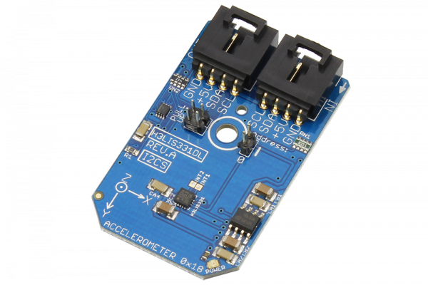

# H3LIS331DL
The H3LIS331DL, manufactured by STMicroelectronics, is a low-power high performance 3-axis linear accelerometer belonging to the “nano” family, with digital I2C serial interface. The H3LIS331DL has dynamically user selectable full scales of ±100g/±200g/±400g and it is capable of measuring accelerations with output data rates from 0.5 Hz to 1 kHz. 
This Device is available from www.ncd.io 

[SKU:H3LIS331DL_I2CS]

(https://store.ncd.io/product/h3lis331dl-3-axis-linear-accelerometer-i%C2%B2c-mini-module/)
This Sample code can be used with Arduino.

Hardware needed to interface H3LIS331DL sensor with Arduino

1. <a href="https://store.ncd.io/product/i2c-shield-for-arduino-nano/">Arduino Nano</a>

2. <a href="https://store.ncd.io/product/i2c-shield-for-arduino-micro-with-i2c-expansion-port/">Arduino Micro</a>

3. <a href="https://store.ncd.io/product/i2c-shield-for-arduino-uno/">Arduino uno</a>

4. <a href="https://store.ncd.io/product/dual-i2c-shield-for-arduino-due-with-modular-communications-interface/">Arduino Due</a>

5. <a href="https://store.ncd.io/product/h3lis331dl-3-axis-linear-accelerometer-i%C2%B2c-mini-module/">H3LIS331DL 3-Axis accelometer Sensor</a>

6. <a href="https://store.ncd.io/product/i%C2%B2c-cable/">I2C Cable</a>

H3LIS331DL:

The H3LIS331DL, manufactured by STMicroelectronics, is a low-power high performance 3-axis linear accelerometer belonging to the “nano” family, with digital I2C serial interface. The H3LIS331DL has dynamically user selectable full scales of ±100g/±200g/±400g and it is capable of measuring accelerations with output data rates from 0.5 Hz to 1 kHz. 

Applications:

•Shock detection, impact recognition and logging, concussion detection.

How to Use the H3LIS331DL Arduino Library
The H3LIS331DL has a number of settings, which can be configured based on user requirements.

1.Data rate selection:The following command is used to set the data rate of accelometer as 50Hz.

             h3lis.setAccelDataRate(ACCEL_DATARATE_50HZ);                // AODR (Hz): 50
             
2.Range:The following command is used to set the range of accelometer as ±100 G.            
             
             h3lis.setAccelRange(ACCEL_RANGE_100G);                      // ±100 G
